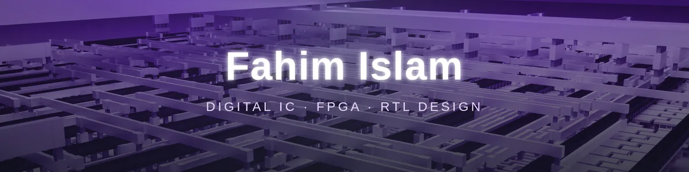
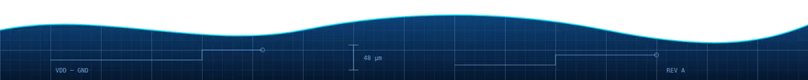

<div align="center">



[](https://git.io/typing-svg)


</div>

---

## 👋 About Me

Third-year **Electrical & Electronic Engineering** student at **American International University-Bangladesh (AIUB)**, obsessed with how a few lines of RTL become real hardware.

- 🔬 Focus: **digital IC & FPGA design**
- 🧠 Strong on **RTL / SystemVerilog**, **FSM-datapath methodology** and **DSP concepts**
- 🏭 Pushing designs through the **RTL-to-GDSII** flow on **sky130**
- 🎮 Building things that are fun: games, displays, radios, radar
- 🎯 Currently exploring **capstone** directions

---

## 🧩 How I Write RTL

Clean, explicit and predictable. FSM and datapath are always separated, with no implicit defaults.

```systemverilog
// Moore FSM — three-block style, named enums from a package
typedef enum logic [1:0] {IDLE, RUN, DONE} state_t;

state_t state_r, state_n;

// 1) state register
always_ff @(posedge clk or negedge rst_n)
  if (!rst_n) state_r <= IDLE;
  else        state_r <= state_n;

// 2) next-state logic (comparator flags feed this, not inline expressions)
always_comb begin
  case (state_r)
    IDLE:    state_n = start  ? RUN  : IDLE;
    RUN:     state_n = k_last ? DONE : RUN;
    DONE:    state_n = IDLE;
    default: state_n = IDLE;
  endcase
end

// 3) Moore outputs — every output assigned in every branch
always_comb begin
  case (state_r)
    IDLE:    begin busy = 1'b0; done = 1'b0; end
    RUN:     begin busy = 1'b1; done = 1'b0; end
    DONE:    begin busy = 1'b0; done = 1'b1; end
    default: begin busy = 1'b0; done = 1'b0; end
  endcase
end
```

> Counters live in separate sequential registers, outside the FSM.

---

## 🚀 Projects

| Project | What it is | Stack |
|---|---|---|
| 🟡 **Pac-Man FPGA Clone** | From-scratch Pac-Man arcade hardware for the Sipeed TangNano9K | SystemVerilog · FPGA |
| ⭕ **Tic Tac Toe** | FPGA game with PKG / FSM / DATAPATH / TOP / TB structure | SystemVerilog |
| 🖥️ **VGA Controller** | VESA 800×600 @ 60 Hz controller (PKG / FSM / DP / TOP) | SystemVerilog |
| 🛰️ **Radar Detection Pipeline** | FMCW → FFT → CFAR aerial vehicle detection on FPGA | DSP · FPGA |
| 📡 **LoRa Receiver** | SX127x-based LoRa RX implemented on FPGA | SystemVerilog |
| 🧮 **MMA Core** | GPU-style matrix multiply-accumulate (Tensor Core-like) core | SystemVerilog |
| 🏭 **mul3x3 ASIC** | 3×3 unsigned sequential multiplier through RTL-to-GDSII | sky130 · LibreLane |
| 🎧 **Lossless Audio Codec** | Encoder + decoder as an ASIC portfolio project | RTL · ASIC |
| ✈️ **PFD Display** | Primary flight display with artificial horizon on a round GC9A01 LCD | ESP32-C3 |
| 🦯 **Blind-Assist Helmet** | Sensory-substitution helmet with haptic feedback from spatial sensing | ESP32 |
| 🎫 **DEF CON-style Badge** | Wearable conference badge with an LED matrix | XIAO ESP32-C6 |
| ❤️ **PPG Pulse Sensor** | Analog photoplethysmography front-end circuit design | Analog |

> 📌 Pin your favourites and link each project to its repo.

---

## 🛠️ Toolbox


**Methodology:** ASM chart → RTL · FSM/datapath separation · Moore machines · package-defined enums · testbench-driven verification

---

## 📊 GitHub Stats

<div align="center">


</div>

---

## 🔭 What I'm Exploring

- 🎓 Capstone project ideas in digital IC / FPGA
- 🏭 More tape-out-style ASIC flows on open-source PDKs
- 📶 DSP-heavy FPGA pipelines (radar, radio, audio)

---

<div align="center">

[](mailto:YOUR_EMAIL)
[](https://linkedin.com/in/YOUR_LINKEDIN)

```
  always_ff @(posedge coffee) begin
      code <= more_code;
  end
```



</div>
